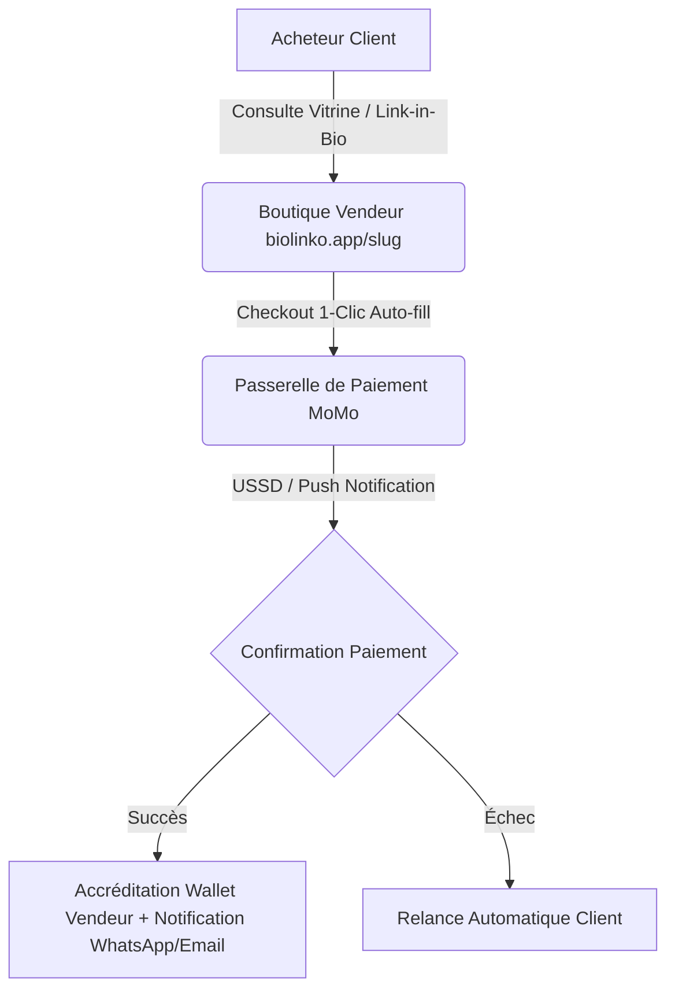

# 🚀 BIOLINKO — Rapport Stratégique : Le Shopify Amélioré pour l'Afrique

---

## 🎯 1. Vision & Positionnement du Produit

**BIOLINKO** est une plateforme SaaS e-commerce et de commerce social (Social Commerce) conçue spécifiquement pour les réalités du marché africain. 

Contrairement aux solutions occidentales comme Shopify qui imposent des abonnements mensuels élevés en devises étrangères ($29-$299/mois), nécessitent des cartes bancaires de crédit et supposent une logistique postale structurée, **BIOLINKO** résout directement les 4 verrous majeurs du commerce en Afrique :

1. **Expérience d'achat ultra-rapide en 1-Clic sans création de compte complexe** (Conversion maximisée via Mobile Money & WhatsApp).
2. **Intégration native du Mobile Money (MTN MoMo, Orange Money)** avec encaissement instantané et système de portefeuille vendeur.
3. **Optimisation pour le Social Commerce** (Vendeurs Instagram, TikTok, WhatsApp Business) grâce aux Smart-Links produits réutilisables.
4. **Modèle économique adapté au marché local** (Micro-commissions au succès de vente + Abonnements abordables en FCFA).

---

## 🇨🇲 2. Stratégie de Lancement : Focus Cameroun

Pour garantir un taux de succès maximal et valider le modèle avant l'expansion sous-régionale (CEMAC/UEMOA), l'application commence par un **ancrage 100% Cameroun**.

### Pourquoi le Cameroun comme Marché Initiateur ?
- **Taux de pénétration Mobile Money > 75%** (Duopole fort MTN Mobile Money & Orange Money Cameroun).
- **Commerce informel et social en pleine explosion** (Des dizaines de milliers de vendeurs sur WhatsApp, Instagram, Facebook Marketplace).
- **Manque d'outils locaux automatisés** (Les vendeurs gèrent leurs ventes manuellement par messages WhatsApp avec des pertes énormes de conversions).

---

## ⚙️ 3. Fonctionnalités Clés & Mode de Fonctionnement

BIOLINKO est structuré autour de 4 piliers technologiques :



### A. Espace Vendeur (Dashboard & Gestion)
- **Création de Boutique en 60 secondes** avec identifiant unique (`biolinko.app/nom-boutique`).
- **Gestion Avancée du Catalogue** : Produits simples, déclinaisons/variantes (Tailles, Couleurs), images multiples HD, promotions temporaires et gestion du stock critique.
- **Studio de Personnalisation Visuelle (`Appearance`)** : Bannières Hero, témoignages/avis clients intégrés, badges de confiance.
- **Gestion des Commandes & Factures** : Statuts en temps réel (*En attente, Payée, Expédiée, Livrée*), génération de reçus PDF numériques et QR Code de suivi.
- **Portefeuille Mobile Money & Retraits** : Solde disponible alimenté instantanément à chaque vente, bouton de retrait vers MTN / Orange Money avec frais calculés.
- **Répertoire Clients CRM** : Historique des acheteurs, fréquence d'achat, montant total dépensé et bouton de contact direct **WhatsApp 💬**.

### B. Expérience Client (Storefront & Checkout)
- **Vitrine responsive ultra-rapide** (Mobile-first, temps de chargement < 1 sec).
- **Caisse 1-Clic (Frictionless Auto-fill)** : Mémorisation locale sécurisée du profil acheteur (Nom, Téléphone, Adresse). Lors des achats futurs dans n'importe quelle boutique du réseau, le formulaire se pré-remplit automatiquement.
- **Paiement Mobile Money Simplifié** : Déclenchement automatique du paiement MoMo / Orange Money par Push USSD direct sur le téléphone du client.

---

## 💳 4. Architecture Technique : Segmentation & Multi-Pays des APIs de Paiement

### ❓ Question : *Puis-je segmenter les APIs de paiement et appeler la bonne passerelle selon le pays ?*

**RÉPONSE : OUI, ABSOLUMENT !** C'est la meilleure pratique d'ingénierie logicielle pour construire une plateforme pan-africaine résiliente.

### Architecture Recommandée : Pattern Adapter / Driver

Au lieu de lier l'application à un seul fournisseur de paiement, nous implémentons un **Payment Engine Multi-Pays** basé sur une interface unique (`PaymentGatewayInterface`).

```
                              [PaymentManager]
                                     │
         ┌───────────────────────────┼───────────────────────────┐
         ▼                           ▼                           ▼
[CameroonPaymentAdapter]   [CoteIvoirePaymentAdapter]   [SenegalPaymentAdapter]
 (MTN MoMo / Orange)          (Wave / Orange / MTN)        (Wave / Free Money)
         │                           │                           │
         ▼                           ▼                           ▼
  API Ligne Directe           API Ligne Directe           API Ligne Directe
 (CinetPay/NotchPay)             (Paystack)                  (Bizao)
```

#### Exemple de Déroulement en Code (Laravel Service Pattern) :

1. **Détection Automatique du Pays** :
   - Par l'indicatif téléphonique du client (`+237` = Cameroun, `+225` = Côte d'Ivoire, `+221` = Sénégal).
   - Ou par le pays configuré dans la boutique du vendeur.

2. **Interface Unique de Paiement** :
```php
interface PaymentGatewayInterface {
    public function initiatePayment(Order $order, string $phoneNumber): PaymentResponse;
    public function verifyPayment(string $transactionId): PaymentStatus;
    public function processPayout(Withdrawal $withdrawal): PayoutResponse;
}
```

3. **Factory & Routage dynamique** :
```php
class PaymentGatewayFactory {
    public static function make(string $countryCode): PaymentGatewayInterface {
        return match ($countryCode) {
            'CM' => app(CameroonPaymentDriver::class), // MTN/Orange Cameroun (via NotchPay/CinetPay)
            'CI' => app(CoteIvoirePaymentDriver::class), // Wave/MTN/Orange CI (via Paystack)
            'SN' => app(SenegalPaymentDriver::class),    // Wave/Free Sénégal
            default => app(DefaultGlobalPaymentDriver::class),
        };
    }
}
```

### Agrégateurs Recommandés au Cameroun :
- **NotchPay** ou **CinetPay** (Excellente couverture MTN MoMo Cameroun + Orange Money Cameroun avec Webhooks instantanés et API de décaissement/Payouts).
- **Express Union Mobile / Campay** (En backup direct).

---

## 💰 5. Modèle Économique & Sources de Revenus (Monetization Strategy)

Pour assurer une rentabilité forte et récurrente, BIOLINKO s'appuie sur **5 leviers de monétisation** :

| # | Source de Revenu | Description & Fonctionnalité | Potentiel de Gain |
|---|---|---|---|
| **1** | **Commissions sur Transactions (Pay-per-sale)** | Prélèvement d'un pourcentage fixe (ex: 2% à 3.5%) sur chaque commande payée via la plateforme. | **Élevé & Évolutif** (Récidive des ventes quotidiennes des boutiques). |
| **2** | **Abonnements SaaS Mensuels / Annuels** | - **Plan Gratuit (Starter)** : 10 produits max, 3.5% commission.<br>- **Plan Pro (Starter Pro)** : 9 900 FCFA/mois (Produits illimités, 1.5% commission, Domaine perso).<br>- **Plan Business (Scale)** : 24 900 FCFA/mois (0% commission, support VIP). | **Revenu Récurrent Prévisible (MRR)**. |
| **3** | **Frais de Décaissement / Retrait MoMo** | Frais de traitement fixe (ex: 100 à 250 FCFA) appliqués lors des demandes de retrait de solde du Wallet vendeur. | **Revenu Passif sur les flux financiers**. |
| **4** | **Noms de Domaine Personnalisés** | Revente et configuration automatisée de noms de domaine personnalisés (`boutique.cm`, `boutique.com`). | **Marge nette ~40%** par domaine configuré. |
| **5** | **Thèmes & Add-ons Premium** | Vente de modèles de vitrines premium, modules de SMS Marketing ciblé et badges de certification vendeur. | **Achats ponctuels à forte marge**. |

---

## 📋 6. Feuille de Route d'Évolution (Roadmap)

### Phase 1 : Consolidation Cameroun (En cours - 100% Opérationnel)
- Core multi-vendeurs, catalogue produits avec promotions et variantes.
- Répertoire clients CRM, formulaires auto-fill.
- Panel Super-Admin et espaces vendeurs hermétiques.

### Phase 2 : Automatisation de la Passerelle MoMo Cameroun
- Intégration de l'API de paiement Push USSD (NotchPay/CinetPay/Campay).
- Déclenchement automatique des Payouts MoMo lors des retraits vendeurs.

### Phase 3 : Module d'Expéditions & Logistique Locale
- Partenariats et intégration des agences de livraison locales (Yango Delivery, livreurs indépendants par ville : Douala, Yaoundé, Bafoussam).

### Phase 4 : Expansion Sous-Régionale (CEMAC & UEMOA)
- Activation des Drivers de paiement pour la Côte d'Ivoire, le Sénégal et le Gabon.
- Support multi-devises (FCFA XAF, FCFA XOF, EUR, USD).
